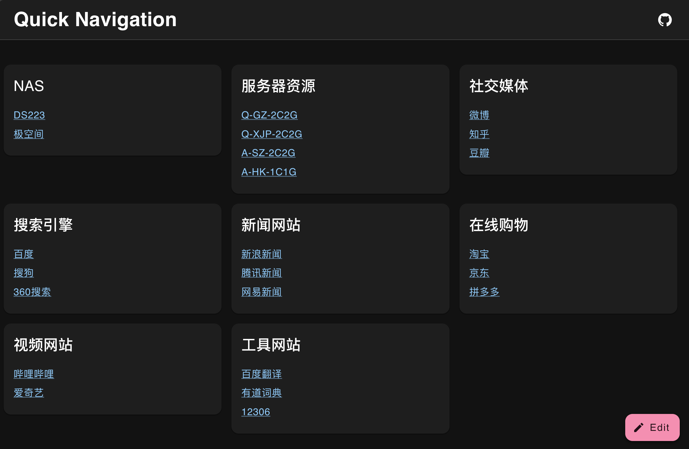
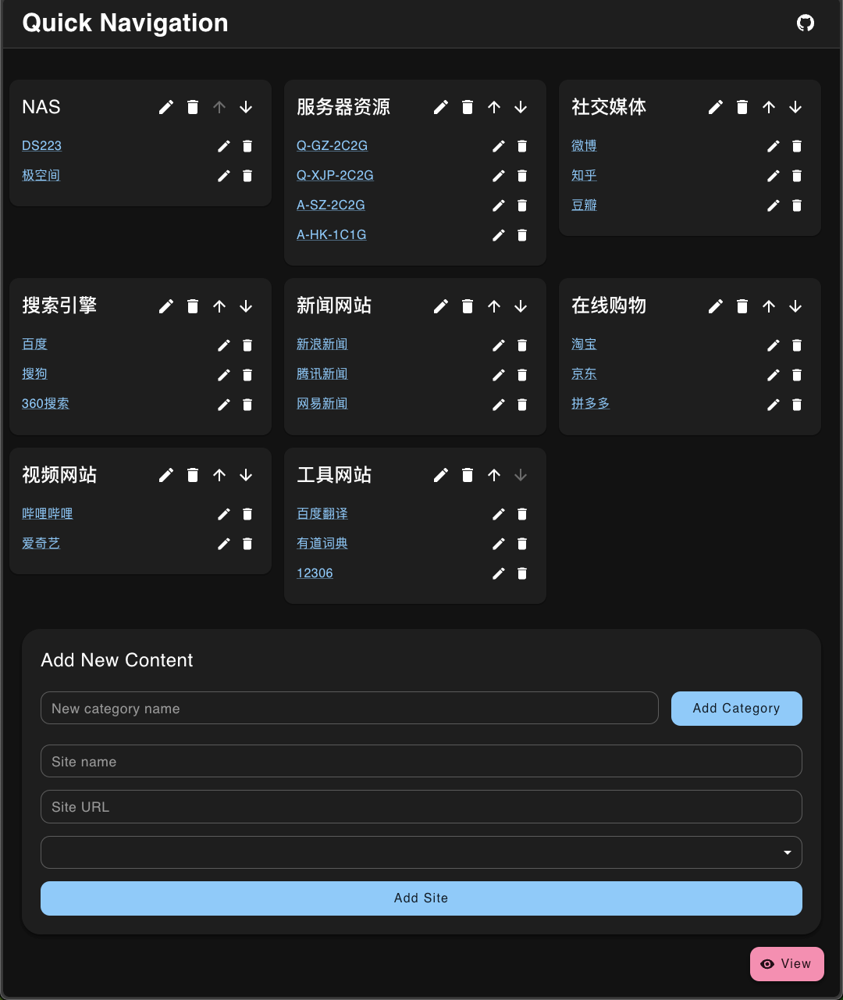

# QuickNav

QuickNav 是一个使用 Go 和 SQLite 构建的轻量级、高效的网页导航工具。它为您提供了一个个性化的中心，可以快速访问您喜爱的网站。

[English README](README.md)

## 查看器

## 编辑器

## 描述

QuickNav 作为您的个人互联网指南针，提供了一个清晰直观的界面来管理和访问您经常访问的网站。它以简单和高效为设计理念，非常适合开发人员、学生或任何希望简化网络浏览体验的人。

## 特性

-   **简洁界面**：清晰的设计，便于导航
-   **快速添加**：轻松添加新的网站链接
-   **本地存储**：使用 SQLite 数据库进行安全存储
-   **单一二进制部署**：只需一个可执行文件即可轻松部署
-   **跨平台**：可在 Windows、Mac 和 Linux 上运行
-   **离线可用**：无需互联网连接也可完全功能

## 安装

1. 前往 QuickNav 仓库的 [Releases](https://github.com/xwzy/QuickNav/releases) 页面。
2. 下载适用于您操作系统（Windows、macOS 或 Linux）的最新版本。
3. 将下载的文件解压到您选择的位置。

## 使用方法

1. 打开终端或命令提示符。
2. 导航到您解压 QuickNav 的目录。
3. 运行 QuickNav 可执行文件：
    - 在 Windows 上：双击 `QuickNav.exe` 文件或从命令行运行它。
    - 在 macOS/Linux 上：打开终端并运行 `./QuickNav`
4. 打开您的网络浏览器并访问 `http://localhost:8080`
5. 开始添加您喜爱的网站！

注意：首次运行 QuickNav 时，它将在同一目录下创建一个 `nav.db` 文件。该文件用于存储您的网站链接。

## 贡献

欢迎贡献！请随时提交 Pull Request。

## 许可证

本项目采用 MIT 许可证 - 详情请参阅 [LICENSE](LICENSE) 文件。

## 致谢

-   感谢 Go 社区提供优秀的 `database/sql` 包
-   特别感谢 `github.com/mattn/go-sqlite3` 项目为 Go 提供 SQLite 支持
